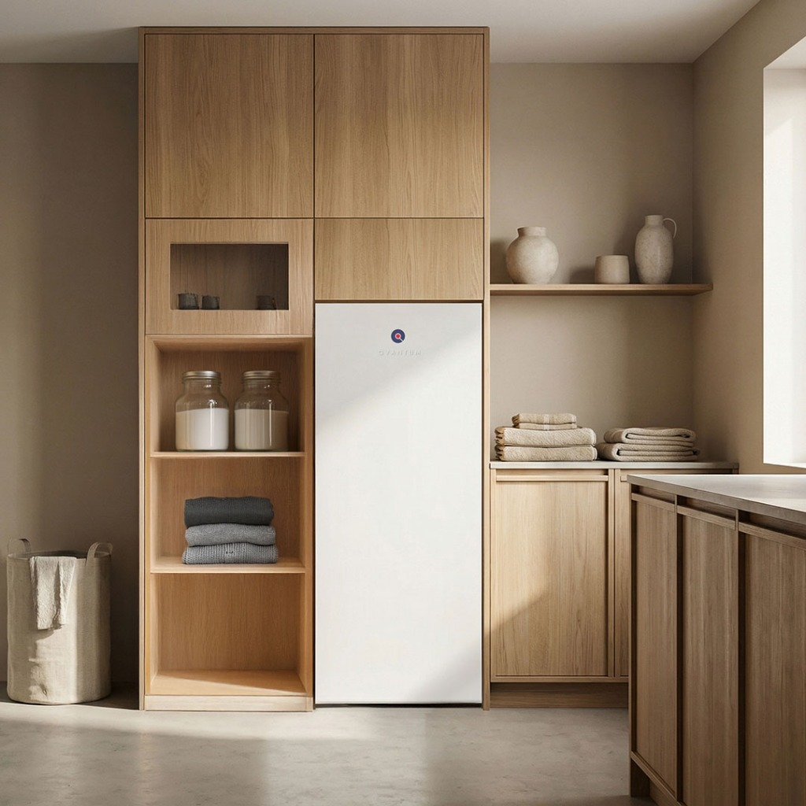

En värmepump är en av de bästa investeringarna du kan göra för att sänka dina uppvärmningskostnader och bidra till en bättre miljö. Vi på VVS Projekt erbjuder professionell installation, service och underhåll av alla typer av värmepumpar – från luft/luft och luft/vatten till bergvärme och frånluftsvärmepumpar. 

### Vår rekommendation: Smarta värmepumpar från Qvantum
Vi arbetar med alla ledande varumärken, men för många av våra aktuella projekt rekommenderar vi varmt system från **Qvantum**. Som innovatör på marknaden bygger Qvantum framtidens värmepumpar med en helt digital plattform som är smart från start.

Några av de största fördelarna med en anläggning från Qvantum inkluderar:
- **Spotprisoptimering:** Sänk dina uppvärmningskostnader genom att systemet automatiskt anpassar driften efter elprisets svängningar.
- **Over The Air-uppdateringar:** Värmepumpen uppdateras ständigt över nätet med ny mjukvara för att alltid prestera på topp.
- **Förberedd för flexmarknaden:** Unik teknik som termiska batterier och anpassning för elstödstjänster gör dig redo för framtidens energimarknad.

Att välja rätt värmepump kan kännas som en djungel, men vi finns här för att guida dig. Genom en noggrann energianalys hjälper vi dig hitta den optimala lösningen utifrån just dina behov. Våra installatörer är certifierade och har lång erfarenhet av branschen, vilket garanterar att arbetet utförs med högsta kvalitet.

Efter installationen lämnar vi dig inte i sticket – vi erbjuder löpande service och underhåll för att säkerställa att din värmepump fortsätter att prestera på topp år efter år.
